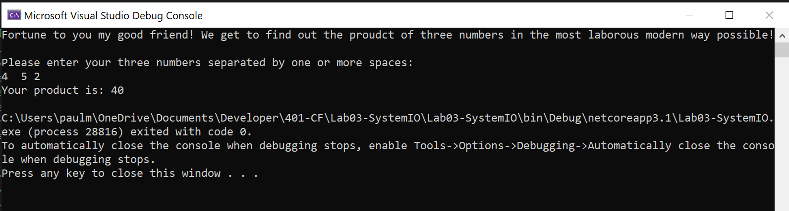
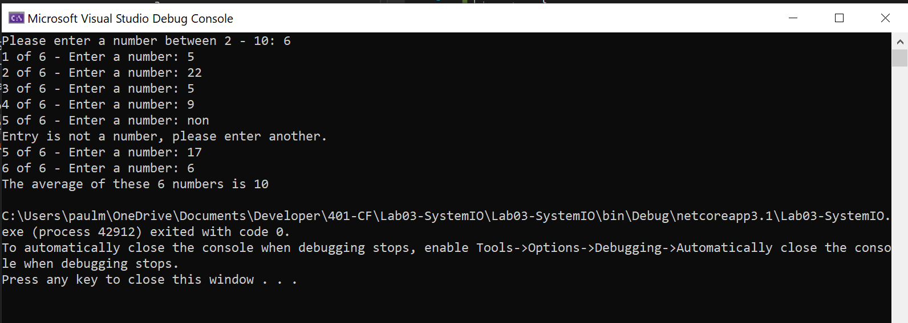
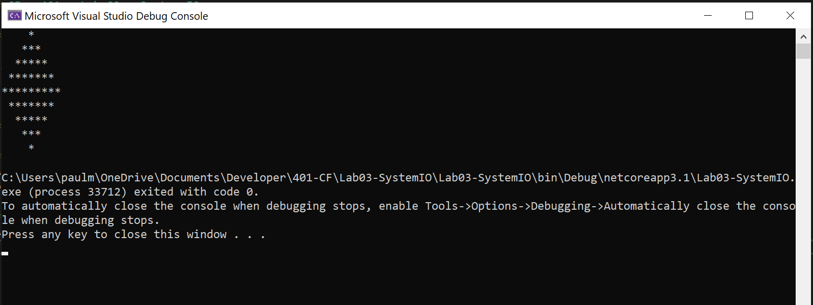
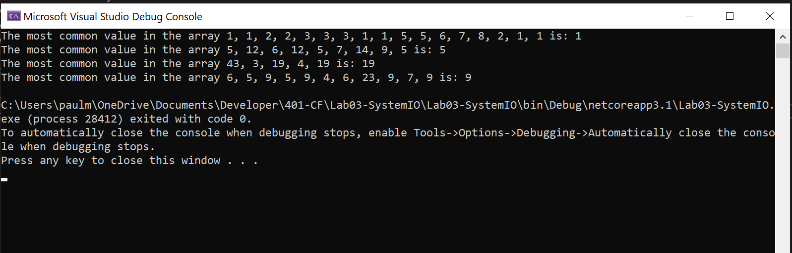
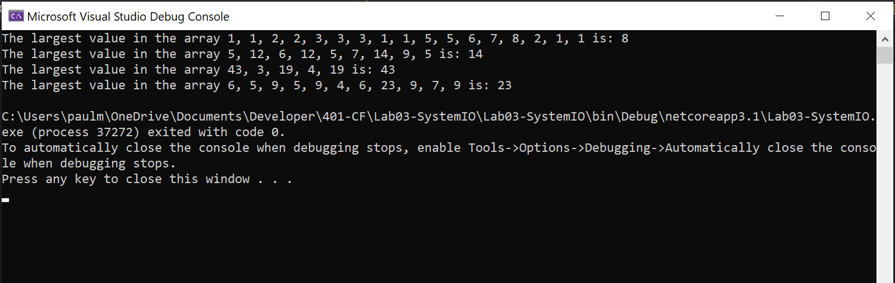
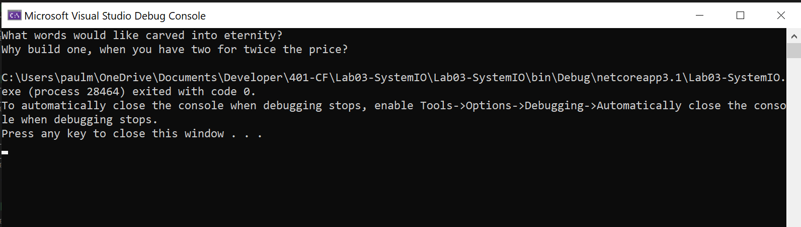
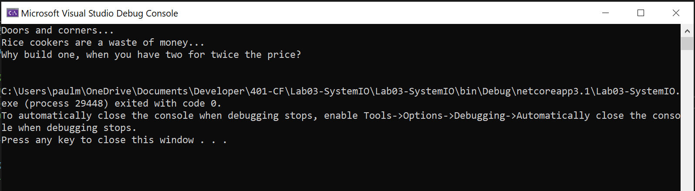

# CF - 401 - Lab 03 - System IO

## Various Code Challenges

*Author: Paul M Rest*

----

## Descriptions

### Challenge 1
A console app that prompts the user for three or more numbers. Calculates the product
of those numbers and shows it to the user.

### Challenge 2
A console app that prompts the user for a number between 2 - 10. User then enters that many numbers, and app calculates the average of those numbers (as integer rounded down) and shows it to the user.

### Challenge 3
Print the following figure to the console:

```
    *
   ***
  *****
 *******
*********
 *******
  *****
   ***
    *
```

### Challenge 4
A method that finds the most common value in an array of integers.

### Challenge 5
A method to find the largest value in an array of integers.

### Challenge 6
A console app that gets the user's input and writes that to a file "words.txt". If file exists and has content, appends new content on a new line.

### Challenge 7
A console app that writes the contents of the file "words.txt" to the console. If the file has multiple lines, each line is written as a new line.

---

### Getting Started
Clone this repository to your local machine.

In a command line environment with Git installed:

```
git clone <<GIT REPO URL HERE>>
```

### To Run the Program from Visual Studio (2019):
Select ```File``` -> ```Open``` -> ```Project/Solution```

Next navigate to the directory you cloned the repository to.

Double click on the ```Lab03-SystemIO``` directory.

Then select and open ```Lab03-SystemIO.sln```

All method invocations have been commented out in the Main() method. Uncomment the Code Challenge you'd like to run.

Select ```Debug``` -> ```Start Debugging``` to the run the app with the debugger

OR

Select ```Debug``` -> ```Start Without Debugging```

---

### Visuals

#### Challenge 1


#### Challenge 2


#### Challenge 3


#### Challenge 4


#### Challenge 5


#### Challenge 6


#### Challenge 7


### Change Log

#### 2020-07-08
- Challenge 01 and README template completed. 16:33 PDT
- Challenge 02 and tweaks to README. 18:15 PDT
- Challenge 03. 19:58 PDT
- Challenge 04. 21:10 PDT
- Challenge 05. 21:54 PDT
- Challenge 06. 22:15 PDT
- Challenge 07. 22:37 PDT

------------------------------
For more information on Markdown: https://www.markdownguide.org/cheat-sheet
